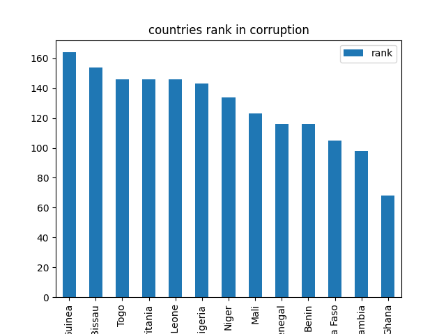
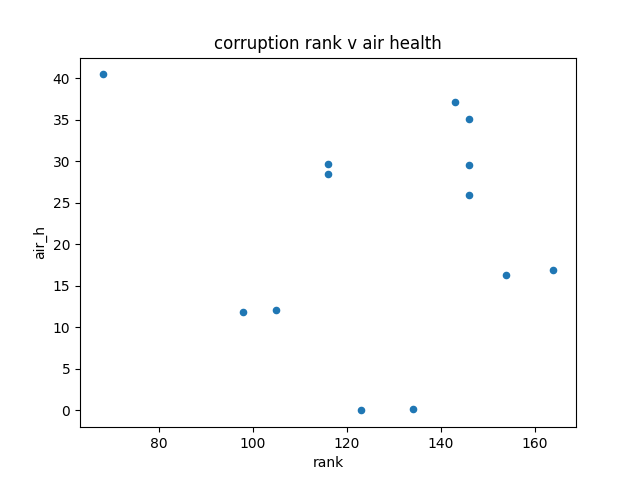

# Environment-Corruption 

## Table of Contents 

- [Project Overview](#project-overview)
- [Data Sources ](#data-sources)
- [Tools](#tools)
- [Methodology](#methodology)
- [Exploratory Data Analysis](#exploratory-data-analysis)
- [Data Analysis](#data-analysis) 
- [Results Findings](#results-findings)
- [Recommendations](#recommendations)
- [Next Action](#next-action)
- [Tableau](#tableau)

## Project Overview 

I developed a comprehensive pipeline to analyze the Environmental Performance Index (EPI) and Corruption Index (CI) of nations within the Western African subregion. This project aims to uncover the relationships and trends between environmental performance and regional corruption levels.

## Data Sources
Data: The primary dataset used for this analysis is in the 'CPI-2010-new_200601_105629.csv' file.

## Tools
The tools you used for this project include:

- SQLAlchemy: To connect and interact with the PostgreSQL database.
- PostgreSQL: As the database to store and query the Environmental Performance Index (EPI) data.
- Python libraries:
   - Pandas: For data manipulation and analysis.
   - Matplotlib.pyplot: For creating visualizations.
- Tableau: For additional data visualization and analysis.

## Methodology

In the data analysis phase, the following tasks were performed:

1. Data loading and inspection.

2. Established a connection to the PostgreSQL database using SQLAlchemy and psycopg2, targeting the Environmental Performance Index (EPI) data.

3. Queried the epi_country table from the database and stored the results in a Pandas DataFrame for further analysis.

4. Focused the analysis on the geographical subregion of Western Africa by filtering the EPI data accordingly.

5. Imported the Corruption Index (CI) data from a CSV file into a Pandas DataFrame. After checking for null values, none were found, ensuring the data was clean for analysis.

6. Created a SQL table for the Corruption Index (CI) data using the df.to_sql method, then performed a left join on the country field to merge the EPI and CI DataFrames.

7. Generated visualizations to explore and illustrate the relationships between the EPI and CI metrics across Western Africa, providing insights into the correlations between environmental performance and corruption levels in the region.

## Exploratory Data Analysis

EDA involved exploring the data to answer key questions such as:

- What is the relationship between corruption scores and environmental health indicators like water and air quality?
  
- How does the corruption rank correlate with environmental performance in Western African nations?
  
- Are there any patterns or trends in corruption and environmental health across different countries in Western Africa?
  
- Which nations in Western Africa have the highest and lowest corruption scores, and how does this impact their environmental health?
  
- Is there a significant difference in environmental performance between countries with high corruption versus those with lower corruption?

## Data Analysis

Here are some examples of the visuals from the analyses

This visualization highlights the relationship between nations in Western Africa and their corruption rankings. It reveals that most countries in the region are among the most corrupt globally, with some ranking as high as 178, indicating a severe level of corruption.

This visualization illustrates the relationship between nations in Western Africa and their corruption scores. By comparing the corruption scores with the rankings, we can observe that Guinea, for example, has a lower score and a higher corruption rank. This makes sense because a higher corruption score indicates less corruption. In comparison to other regions, West African nations have notably low scores, reflecting significant levels of corruption, with the highest corruption score in the region being only 9.3.

This graph explores the relationship between corruption scores and water health in Western Africa. The analysis reveals that there isn't a strong correlation between the two. For instance, nations with a corruption score of 4.0 exhibit water health levels ranging from 30 to 32. However, some countries with lower corruption scores also show lower water health, suggesting that while corruption may impact water health, the relationship isn't straightforward or consistent across the region.

This graph demonstrates the relationship between corruption rank and air health in Western Africa. It reveals a clear trend: the more corrupt a nation (indicated by a higher corruption rank), the lower its air health. Conversely, nations with a lower corruption rank tend to have better air health, suggesting that higher levels of corruption may be linked to poorer air quality in the region.

## Results Findings
The analysis results are summarized as follows:

- There is a noticeable trend where nations with higher corruption ranks tend to have poorer environmental health, particularly in terms of air quality. This suggests a potential link between corruption levels and environmental degradation.
- The relationship between corruption scores and water health is less clear. While some nations with lower corruption scores have lower water health, there isn't a strong overall correlation, indicating that other factors may be influencing water quality in the region.
- Most countries in Western Africa rank among the most corrupt globally, with some having corruption scores as low as 4.0, which is associated with significant governance challenges.
- Guinea stands out with a lower corruption score but a high corruption rank, highlighting the complex dynamics between corruption perception and actual governance quality in the country
- Overall, Western African nations exhibit low environmental performance, which is closely tied to their high levels of corruption. The highest corruption score in the region is 9.3, reflecting widespread governance issues that impact environmental policies and outcomes.

## Recommendations
Based on the analysis, the following is recommended:

- Given the clear link between high corruption levels and poor environmental health, it is crucial to implement stronger anti-corruption measures in West African nations. Reducing corruption could lead to significant improvements in environmental policies.
- Focused investment in improving air and water quality is needed, particularly in nations with high corruption ranks. Prioritizing environmental health could mitigate some of the negative impacts of corruption on the population’s well-being.
- Increasing transparency and accountability in environmental governance can help address the underlying issues related to corruption. Public access to environmental data and decision-making processes should be improved.
- Western African nations should collaborate on regional initiatives to tackle both corruption and environmental challenges. Sharing best practices and resources could lead to more effective solutions across the region.

# Next Action

Further actions to enhance this project could include: 

- Expanding the analysis by including other socioeconomic and environmental factors, such as education levels, healthcare access, and biodiversity, could provide a more comprehensive understanding of how corruption impacts various aspects of development in Western Africa.
- Investigating how corruption levels correlate with life expectancy to reveal the impact of corruption on public health and overall well-being, also examining the relationship between corruption and a country's level of democracy to uncover how governance structures influence both corruption and public health outcomes.
- Conducting a time-series analysis to examine how corruption and environmental health have evolved over the years could reveal trends and help identify periods of significant change or policy impact.
- Implementing machine learning models to predict environmental health outcomes based on corruption scores and other factors could provide valuable insights for policymakers.
- Extending the analysis to include other African subregions or even global comparisons could highlight whether the trends observed in Western Africa are unique or part of broader continental or global patterns.

## Tableau
Tableau [Download here](https://public.tableau.com/app/profile/thierno.barry8424/viz/EPIvCPI/Dashboard1?publish=yes)
