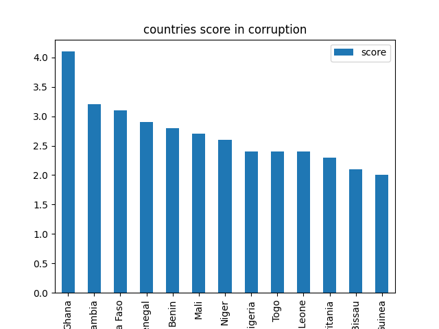
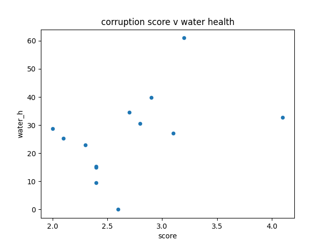

# Environment-Corruption 

Created a pipeline that analyses the Environmental Performance Index (EPI) and the Corruption Index (CI) of nations in the subregion of Western Africa. To start I used sqlalchemy, and created an engine to connect to Postgresql and psycopg2 and to the epi database. After, I queried the database in order to be able to request the data from the epi_country table, then created a pandas DataFrame to save the epi_country table. Furthermore, I filtered epi data to get data for the geographical subregion of Western Africa. For the corruption index, read the CSV file into the pandas Dataframe, then drop null values however, there were no null values which are good for our analysis. Using the CI Dataframe, create a table in SQL using df.to_sql method. Now that I have both the EPI and CI dataframe I did a left join on the country. Lastly, create visualizations to show the relationship between the columns in the epi and ci tables. 

# Result 

This visualization displays the relationship between nations in Western Africa and their corruption rank. Most of the countries in West Africa rank among the top most corrupt nations around the world as the highest corrupted rank country at 178.

This visualization displays the relationship between nations in Western Africa and their corruption score. If we compare these nation corruption score and their rank we can see that Guinea have a lower score and a high rank in corruption which make sense because the higher the score the less corrupt. Also, compare to all other nations the West African nations have very low scores meaning there is a lot of corruption in these nations because the highest corruption score is 9.3. 

In this graph, the relationship between corruption score and water health shows that there is not much of a correlation between the two, because corruption scores of 4.0 have water health of 30-32. However, some of the lower corruption scores show lower water health. 

In this graph, the relationship between corruption rank and air health shows that the more corrupt the nation the lower the air health, and the lower the corruption rank the higher the air health.

# Next Action
The next action I can take is to look into the relationship between corruption and life expectancy, or a country's democracy, also corruption, and the country's annual income or economic development. 

Using Tableau I plotted environmental health from the epi metric and created a map. Based on this visualization many African nations and some East Asians and one or two from South America have very bad environmental health. In the other map in which I created a parameter for countries based on their corruption ranking, there are very few nations with a corruption rank of less than 50. Lastly, after graphing a parameterized scatter plot to see the effect of a country's corruption score on air and water health, I can conclude that based on the graphs most countries with a good score tend to have very good water and air health. However, there are few nations with a bad score with good water and air health. 

https://public.tableau.com/app/profile/thierno.barry8424/viz/EPIvCPI/Dashboard1?publish=yes 
